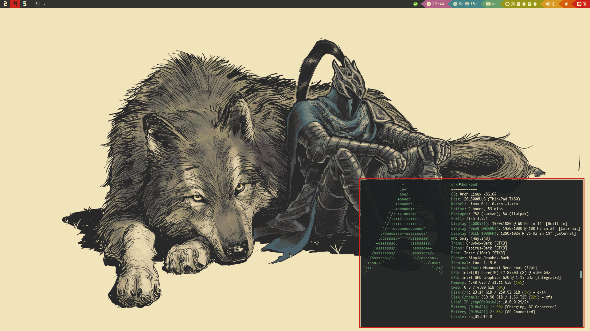

<div align="center">
    <picture>
        <source srcset="./assets/logo-dark.png" media="(prefers-color-scheme: dark)">
        <source srcset="./assets/logo-light.png" media="(prefers-color-scheme: light)">
        
    </picture>
    <h4>My custom suckless based desktop focused on absolute productivity and workflow control.</h4>
</div>



## Key Features

### dwm features
* **A bunch of extra layouts**
    - *Default ones:*
        - master & stack.
        - floating.
        - monocle
    - *Added ones:*
        - dwindle.
        - spiral.
        - centered master (also known as three column).
        - centered floating master (master window floating at the center of the screen, stack on the back).
        - grid.
* **Keychord based keybindings:** Just like emacs, you can have chained keybindings, which exponentially extends the amount of keybindings you can have.
* **Scratchpad support:** Convenient scratchpad functionality for storing and retrieving frequently used applications.
* **Tag based workflow**
    - Each tag (also called workspaces) is meant to have it's purpose, this is achieved with an extensive set of window rules:
        - *Tag 1:* Coding
        - *Tag 2:* Testing
        - *Tag 3:* Web browsing
        - *Tag 4:* Chatting
        - *Tag 5:* Audio tools
        - *Tag 6:* Video tools
        - *Tag 7:* Graphic tools
        - *Tag 8:* Office & Document tools
        - *Tag 9:* Gaming

### Other suckless utilities included

 * *dmenu:* the best run launcher. This build includes some very useful scripts for things like wifi, bluetooth and wallpaper configuration, drive mounting, etc.
 * *st:* the fastest terminal emulator ever, [siduck's build](https://github.com/siduck/st).
 * *slock:* simple and efficient lock screen with fingerprint reader support.
 * *dwbmlocks:* what enables you to customize dwm's status area in the bar. This build includes some cool & customizable status scripts.

### Config files

Other configuration files included in this project are available at the config folder. These are:

* `.bash_profile & .bashrc`: Bash configuration files, the profile is neccesary to start up dwm on tty login.
* `.config/btop`: [btop](https://github.com/aristocratos/btop) is a system monitoring utility, cooler than htop. Accesible from dwm via a scratchpad.
* `.config/gtk-2.0` & `.config/gtk-3.0`: GTK theeming files, I use the Cantarell font, the [Gruvbox-Dark-BL](https://github.com/Fausto-Korpsvart/Gruvbox-GTK-Theme) theme and the [Simp1e-Gruvbox-Dark](https://gitlab.com/cursors/simp1e) cursor theme.
* `.config/Kvantum`: Qt theeming via Kvantum, Gruvbox theme is included here too.
* `.config/lvim`: [Lunarvim](https://www.lunarvim.org/) configuration files, this is a neovim distribution and my text editor of choice.
* `.config/mpv`: Mpv config files, mainly just for vim-like keybindings.
* `.config/newsboat`: [Newsboat](https://github.com/newsboat/newsboat) is an awesome RSS/Atom feeds reader for the terminal. Also accesible from dwm via a scratchpad. The config file is for vim-like keybindings and also my collection of RSS & YouTube subscriptions feeds (you can open any video in mpv hitting first comma and then v).
* `.config/picom`: The only X compositor that actually works, responsible of transparency and some animations.
* `.config/dunst`: A cool, minimal and fast notification daemon. Best one out there.
* `.config/qutebrowser`: Sometimes I like using a minimal browser, and qutebrowser is the best one.
* `.config/X11`: This is where I put the xinitrc file, responsible of starting up dwm properly.
* `.config/vifm`: [vifm](https://vifm.info/) is the best terminal file manager with everything you will and may need, with vim-like keybindings and image previews (with ueberzug).
* `.config/zathura`: [zathura](https://git.pwmt.org/pwmt/zathura) is my document viewer of choice, also with vim-like keybindings.

## Dependencies

Make sure to have these dependencies installed in your system, in this case package names are from Void Linux, you'll have to look for the package names in your distribution:

* **Build dependencies**

```
libX11-devel
libXft-devel
libXrender-devel
libXinerama-devel
libXrandr-devel
libXext-devel
imlib2-devel
harfbuzz-devel
fontconfig-devel
gd-devel
pam-devel
libnotify
xinit
setxkbmap
brightnessctl
make
gcc
vala
```

* **Runtime dependencies** (required for dmenu scripts & dwm)

```
fd-find
feh
xdpyinfo
xdotool
xclip
ffmpeg
maim
slop
udisks2
bluez
j4-dmenu-desktop
NetworkManager
power-profiles-daemon
polkit-gnome
unclutter-xfixes
gnome-keyring
picom
ueberzug
```

* **Other dependencies** (scratchpads)

- `bitwarden`: launched with flatpak by default
- `btop`
- `pulsemixer`
- `alsa-utils`
- `newsboat`
- `arandr`
- `mpv`
- `zathura`
- `nsxiv`
- `cmus`
- `cmus-flac`
- `qalculate-gtk`: launched with flatpak by default
- `ytfzf`: [download here](https://github.com/pystardust/ytfzf)
- `ani-cli`: [download here](https://github.com/pystardust/ani-cli)
- `flix-cli`: [download here](https://github.com/d4r1us-drk/flix-cli)

### System stuff (just here to keep track on stuff I need to rebuild the system)

* **System dependencies** (stuff required for the main installation)

```
NetworkManager
dhcpcd
wpa_supplicant
grub-x86_64-efi
efibootmgr
lvm2
cryptsetup
vim
elogind
polkit
dbus
xorg-server
xf86-input-libinput
xss-lock
pipewire
wireplumber
alsa-pipewire
gstreamer1
gstreamermm
gstreamer-vaapi
gst-plugins-bad1
gst-plugins-good1
gst-plugins-base1
gst-plugins-ugly1
bluez
bluez-alsa
libspa-alsa
libspa-bluetooth
mesa
mesa-vaapi
```

* **Intel stuff** (I mainly use intel devices)

```
xf86-video-intel
mesa-intel-dri
mesa-vulkan-intel
intel-media-driver
libva-intel-driver
```

## Installation & How To Modify

After installing them with your package manager of choice, you can do the following to get the source code and start to modify it to your liking.

```bash
# Clone this repository
$ git clone https://github.com/d4r1us-drk/neodotfiles.git

# Go into the repository
$ cd neodotfiles

# Select which project to compile & install (dwm in this case)
$ cd source/dwm

# To install
$ sudo make install && make clean
```

This repository is not a tutorial on how to modify or configure dwm or any of the included suckless tools, you obviusly don't need to learn C to do this, with this build you can start with an usable base and you wont even need to patch anything. If you want to add a patch though, you will need to do this manually, because most patching utilities like `patch` and `git apply` will fail due to how much of the code base I modified myself.

To configure my build, the only file you really need to modify is the `config.h` file in each tool, which has everything commented and explained. Of course this being *my* build, it is already configured for my needs.

## dwm patch list

These are the patches I applied to this dwm build (some of them I modified):

- adjacenttag
- alpha
- alwayscenter
- attachbottom
- autostart
- barpadding
- centeredmaster
- clientindicators
- combo
- cyclelayouts
- fibonacci
- focusmaster-return
- fullscreen
- gridmode
- keychord
- movestack
- pertag
- restartsig
- rmaster
- scratchpads
- statuspadding
- sticky
- stickyindicator
- tag-preview
- tapresize
- truecenteredtitle
- warp
- winicon

## Credits

- dwm and the suckless tools available here are made by the suckless guys at [https://suckless.org](https://suckless.org).
- dwmblocks is made by torrinfail and available [here](https://github.com/torrinfail/dwmblocks)

## License

This project is licenced under the MIT License

